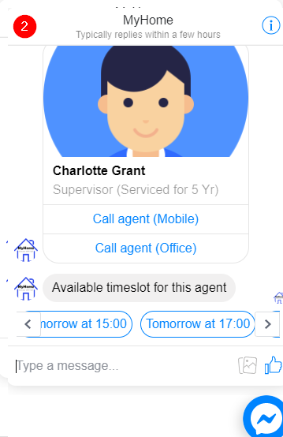
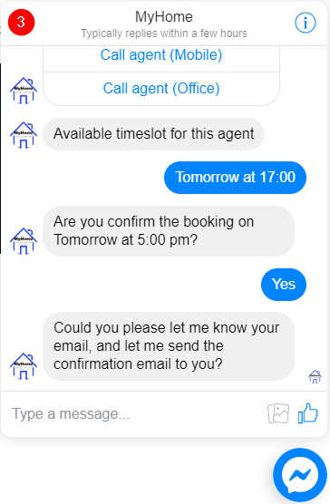
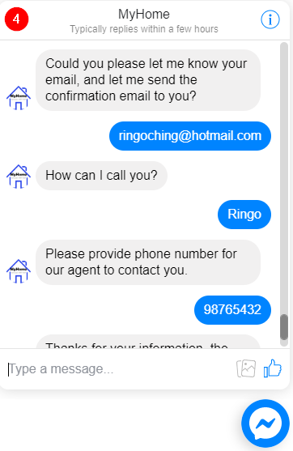

# Property System
*Property System* (this project) has included THREE parts, which is website, chatbot and property management system. The chatbot has embedded in the property website, that make customers can choice use website or chatbot to do what he/she is looking for. For the administator operation, the property management system can help property agents to manage properties and appointments.

## Technical used

1. TensorFlow
    - A open source platform for machine learning, used to analysis user's input message to understand users intend

1. Laravel
    - A PHP framework to make the website and property management system

1. NodeJS
    - Developed as a webhook for communication between MySQL database and frontend 

1. MySQL
    - Used as a data storage for storing property, agent, appointment, etc. 

## Website functions screens
Website 

Property Management System 

## Chat bot functions screens
Search property 

Calulate Mortgage 

Compare mortgage between banks 

Calulate stamp duty (Purchase tax) 

Make an appointment 

 

Confirmation email (Customer) 

Confirmation email (Agent) 

Appointment in calendar view 

Appointment details 

